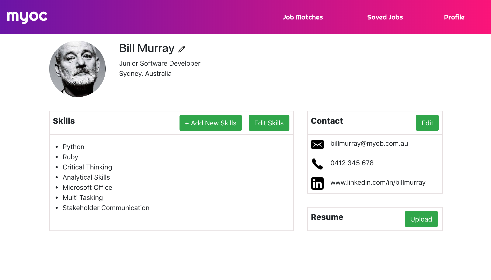

# MYOB HackDays 2019 (5-6 Sep, Sydney)

## What we tried to solve?
According to a MYOB internal survey, employees complained that they didn't have enough resources to see a clear career path inside the company. In order to enhance MYOB employees' awareness of internal job opportunities and provide them with the knowledge about how to upskill, our team designed an app called 'MYOC'(Mind Your Own Career) which ideally can be integrated into MYOB's exisiting employee system.

## What's the solution?
Inside the User Profile page, users can select their current skillsets, upload resumes and set expectations for the next position. Based on these inputs, system automatically recommends matching internal job openings and meanwhile provides a tailored upskill list for the user to be qualified for that particular position.

Collaborating with UX designers and other developers in New Zealand team, I mainly focused on the frontend building the User Profile page.

## Tech used:
* React
* Bootstrap

## How it looks:
<div style={border: 'solid 1px black'}>
  
<div>

## Getting Started
### Prerequisites
Node.js npm or yarn

### Installation
Install NPM packages

```
npm install
```
or
```
yarn install
```

### Run locally
```
npm start
```
or
```
yarn start
```

## Figma Prototype:
Link: https://www.figma.com/file/BHZo4v0LrymWQ1D0cRt74P/MYOC?node-id=0%3A1
